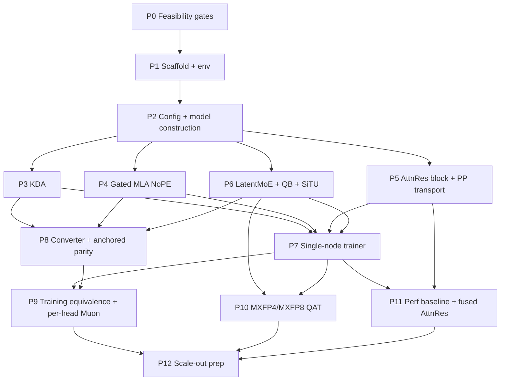

# 01 — Plan-0 Roadmap

> Phase breakdown, dependencies, milestones and risks for bringing **Kimi K3
> training** up in `ROCm/Megatron-LM`. Task-level detail lives in
> [`04-phase-details.md`](04-phase-details.md); file paths in
> [`03-code-layout.md`](03-code-layout.md); gates in
> [`05-test-strategy.md`](05-test-strategy.md).
> This plan supersedes the incoming "rev 2" document; the delta and its
> justification are in [`00-review-findings.md`](00-review-findings.md).

## Guiding principles

| Principle | What it means |
|---|---|
| **Core is read-only** | Everything lands under `kimi_k3/`. Diffs elsewhere fail the guard (allowlist: `.github/workflows/kimi_k3.yml`, `.pre-commit-config.yaml`). Impossible-without-core-edit ⇒ `upstream_proposals/` + issue draft + sign-off (R2.1–R2.3). |
| **Ride core mechanisms, don't clone them** | `adjust_tensor_shapes_fn`, `MoESubmodules.router`, `moe_latent_size`, `clip_qk`, `router_replay`, `LayerWiseDistributedOptimizer` — each replaces a phase we would otherwise write (R2.4). |
| **Correctness is anchored to an FP32 oracle** | Every kernel has an eager FP32 reference in tree, permanently, selectable at runtime. Fast backends default off until their gate is green (R5.3, R8.1). |
| **The release is the source of truth** | Architecture facts come from `config.json` + `modeling_*.py` + shard headers; report-only facts are labelled and treated as weaker (R3.4). |
| **Measured, not assumed** | No node count, optimizer recipe, or bytes/param figure ships without a measurement row (R9.1). |
| **Tiny by default** | Unit and parity tests run the `tiny` preset; official widths are nightly-only; official presets are validated analytically (R4.2, R4.3). |
| **Each phase is independently reviewable** | One phase = one feature commit + one status-pin commit + one `p<id>-summary.md` (R1.3, R3.5). |

## Phase overview

| # | Phase | Type | Tier | Key deliverables | Exit criteria | Status |
|---|---|---|---|---|---|---|
| **P0** | **Feasibility gates** | gate | CPU + 1 GPU | `PINS.md` (5 SHAs + LICENSES), `fla` signature check, K3 config on the real inheritance path, meta-device model construction, optimizer-memory measurement (**incl. `dist_muon` sharding**), AttnRes payload sizing, packed-payload PP=2 prototype, one-expert QAT prototype, external-asset verification | **G1–G8 green.** No porting starts before this. Any red gate is reported, not worked around | not started |
| **P1** | **Scaffold + environment** | scaffolding | CPU + 1 GPU | Branch `dev/wen/kimi-k3` (already open), directory skeleton, `no_core_diff_guard.sh` + allowlist, pre-commit hook script, `tests/test_env.py`, pin-contract tests | G9–G10 green; guard green on a deliberately-bad test diff | not started |
| **P2** | **Config, presets, model construction** | scaffolding | CPU | `KimiK3TransformerConfig(MLATransformerConfig)`, `k3_config_from_args()`, presets (tiny/4L/8L/93L), layer-pattern conformance, `K3GPTModel` via scoped block rebinding, analytic param count | G11–G13 green; 93L meta-device count within 1 % of the architecture table | not started |
| **P3** | **KDA mixer** | **core** | 1 GPU | `kda.py` + `kda_backends.py` (eager \| fla), `kda_eager_fp32.py` oracle mirroring the released kwargs exactly, short-conv + two-gate plumbing, sharded_state_dict | G14–G16 green; component tolerances recorded with their measured floor | not started |
| **P4** | **Gated MLA (NoPE)** | **core** | 1 GPU | `gated_mla.py`: `MLASelfAttention` subclass with rotary bypassed, `scaling = q_head_dim**-0.5`, full-rank sigmoid output gate before `o_proj`, fp32 attention output option, `clip_qk` hook exposed | G17–G18 green; fwd+bwd runs on the fused-attention backend at the 192/128 head-dim combo | not started |
| **P5** | **AttnRes block + pipeline transport** | **core** | 1–2 GPU | `attn_res.py` (fp32 eager mixer oracle), `k3_transformer_block.py`, `attn_res_pp.py` (**single packed tensor** protocol), `k3_schedule.py` (binds `adjust_tensor_shapes_fn` when PP>1) | G19–G22 green, including the payload-gradient assertion (finding A1) and PP=2 vs single-stage loss/grad parity | not started |
| **P6** | **LatentMoE + QB router + SiTU** | **core** | 1–8 GPU | `K3MoELayer` (override `postprocess` for `routed_expert_norm`), `QuantileBalancingRouter(TopKRouter)` + histogram estimator, SiTU-GLU activation, shared experts on hidden | G23–G26 green; QB exact-update parity vs the ported reference on fixed synthetic margins | not started |
| **P7** | **Single-node trainer + optimizer** | integration | 8 GPU | `pretrain_kimi_k3.py`, tokenizer, 4L official config on the **measured** recipe, `tools/mem_budget.py`, `results/opt_mem.md` | G27–G29 green; 50 iters, no NaN, memory report committed | not started |
| **P8** | **Converter + checkpoint-anchored parity** | integration | CPU + 1 GPU | `tools/mapping.py` + `convert.py` (both directions, shard-wise, `dequantize_on_import`), invariant assertions, truncated-HF-reference parity on real layers 1–4 | G30–G33 green; zero unmapped tensors; per-layer hidden-state stats within component tolerances | not started |
| **P9** | **Training equivalence + per-head Muon** | integration | 8 GPU | `tools/twin_run.py` + noise-band measurement, eager-vs-fla twin, `per_head_muon.py` + core `clip_qk` wiring, save/resume stability under PP | G34–G37 green; single-step Muon reference parity; twin within the measured band | not started |
| **P10** | **MXFP4 / MXFP8 QAT** | **core** | 8 GPU | `k3_qat.py` (pack/unpack + e8m0), `k3_qat_experts.py` (`KimiK3QATGroupedMLP`: AITER a8w4 forward, STE backward, packed-cache refresh), QAT-vs-BF16 offset study | G38–G41 green; STE grads exactly match the fake-quant reference; 4L QAT trains | not started |
| **P11** | **Perf baseline + AttnRes/KDA optimisation** | perf | 8 GPU | EP=8 proxy script, chrome trace, ranked-bottleneck report, **fused AttnRes mixer**, `perf/attn_res.md` + `perf/proxy_ep8.md` | G42–G45 green; per-phase budgets set by the baseline report, actual deltas recorded | not started |
| **P12** | **Scale-out preparation** | **[CLUSTER]** | human-run | 93L configs parameterised by measured recipes, PP layout aligned to AttnRes blocks, EP ladder configs, dispatcher A/B matrix, continued-pretrain-flatness scripts | G46–G47: configs + analysis notebooks committed; no cluster job launched by the agent | not started |

## Dependency graph

P3 / P4 / P5 / P6 are the four independent core phases and can be worked in
parallel by different people once P2 lands. P7 is the first phase that needs all
four. P11 needs a *working* trainer, not a fast one — it is deliberately after
P7 and deliberately before the cluster phase.

## Milestones

| Milestone | Scope | Phases |
|---|---|---|
| **M0 — Feasible** | Every dependency pinned and proven; the four risky mechanics (config path, block injection, PP payload, optimizer memory) demonstrated on toy shapes | P0 |
| **M1 — Skeleton builds** | `model_type` selectable, tiny K3 constructs, 93L layer pattern and param count analytically correct | P1 + P2 |
| **M2 — Modules numerically correct** | KDA, MLA, AttnRes, MoE each match their FP32 oracle at tiny scale within recorded tolerances | P3 + P4 + P5 + P6 |
| **M3 — Trains on one node** | 4L official config, 50 iterations, no NaN, measured memory report | P7 |
| **M4 — Anchored to the release** | Converter round-trips; 4-layer slice matches a truncated HF reference | P8 |
| **M5 — Training equivalence** | Twin runs inside the measured noise band; Muon path validated; resume-stable | P9 |
| **M6 — QAT** | a8w4 forward + STE backward trains; offset vs BF16 characterised; serving-logit parity | P10 |
| **M7 — Perf understood** | Baseline trace + ranked bottlenecks + fused AttnRes mixer landed with measured deltas | P11 |
| **M8 — Cluster-ready** | 93L configs and EP ladder handed to a human operator with the analysis tooling | P12 |

## Top risks

| Risk | Impact | Mitigation |
|---|---|---|
| **AttnRes pipeline payload cost** — up to 9 × the normal PP tensor per microbatch, and the mixer materialises `(T, K+1, H)` fp32 twice per layer (architecture §6.1) | PP depth is capped by activation memory; naive implementation may not fit at production width at all | P0-F7 measures it before the design freezes; P5 packs into a single tensor with per-stage exact shapes; CP is the first-class mitigation (`06-capacity-and-parallelism.md`); P11 owns the fused mixer that removes the fp32 temporaries |
| **Payload gradients silently dropped** — core `backward_step` back-props only `output_tensor[0]` | Training "works", loss decreases, model is wrong | Single-packed-tensor protocol (P5) **plus** an explicit gate (G20) that fails when a payload gradient does not reach the previous stage |
| **`fla` `chunk_kda` correctness/stability on gfx950** — known backward bugs upstream (#807, #785) | KDA gradients wrong at production shapes | Eager FP32 oracle stays in tree permanently and is the default until G15 is green at production shapes; failures go to `repro/` with an eager fallback (correct, slow) |
| **Optimizer memory recipe** — the incoming plan's 14 B/param model is wrong (finding A6) | Wrong node counts, wrong config decisions, wasted cluster time | P0-F4 measures Adam / precision-aware Adam+dist-opt / Muon / `dist_muon` per group and produces a `B/param(DP)` curve; `06-capacity-and-parallelism.md` is regenerated from it; no config ships with an unmeasured recipe (R9.1) |
| **AITER / TE asset drift** — the K3 a8w4 kernels and the MXFP4 quantizer path could not be verified in this workspace (findings D1, D2) | P10 has no fast path and no quantizer oracle | P0-F8 fails closed; if the AITER kernels are absent at the pin, P10 ships the BF16 fake-quant path only and the serving-parity criterion is deferred with the reason recorded |
| **93 layers × PP** — 93 is not divisible by any plausible PP degree and AttnRes wants boundaries at multiples of 12 | Unbalanced stages, or a stage boundary in the middle of a block | Explicit `pipeline_model_parallel_layout` per config; the layout table with its block alignment is in `06-capacity-and-parallelism.md`; a config test asserts every boundary is legal |
| **IFU drift on the five core mechanisms we ride** | A silent break after a rebase (worst case: `adjust_tensor_shapes_fn` renamed and PP payload transported wrongly) | `test_k3_p1_pin_contracts.py` in CI stage 0; R10.3 makes re-running it the first task after any IFU |
| **MoE parity depends on report-only behaviour (Quantile Balancing)** | No checkpoint can validate QB; a wrong implementation is invisible until convergence | G25 is exact-update parity against a ported reference algorithm on fixed synthetic margins; the load-ratio metric is *reported*, never a gate |
| **Checkpoint is MXFP4-quantised** | "Parity with the released model" is parity with a dequantised model | Stated in every parity gate; byte-exact packed round-trip only claimed for an untrained checkpoint with preserved scales |

## Time estimate (scheduling only, single engineer, no parallelism)

| Phase | Days | Notes |
|---|---:|---|
| P0 | 3 | Mostly measurement + prototypes; gates the rest |
| P1 | 1 | Guard, skeleton, env |
| P2 | 2 | Config path, presets, construction, param math |
| P3 | 5 | KDA oracle + backend + tolerance work |
| P4 | 3 | MLA subclass + fused-attention bring-up |
| P5 | 5 | AttnRes math + PP packing + gradient gate |
| P6 | 4 | LatentMoE override + QB + SiTU |
| P7 | 3 | Trainer, tokenizer, memory report |
| P8 | 4 | Converter both directions + anchored parity |
| P9 | 4 | Twin runs, Muon, resume |
| P10 | 6 | QAT glue + a8w4 module + convergence study |
| P11 | 5 | Trace, report, fused mixer |
| P12 | 2 | Configs + notebooks (human executes the runs) |
| **Total** | **≈47** | with P3/P4/P5/P6 parallelised → ≈30 calendar days |

## Out of scope (v1)

- **MTP** — the release sets `num_nextn_predict_layers = 0`.
- **Vision tower / `mm_projector`** — text tower only; converter skips them explicitly.
- **KCP / 1 M context** — v1 trains ≤ 64 k.
- **Interleaved pipelining (VPP) with AttnRes** — core rejects custom tensor shapes under VPP (`schedules.py:949`). Revisit only via an upstream proposal.
- **a8w4 backward (dgrad/wgrad in FP4)** — no transposed-scale FP4 weight copy, no weight operand for wgrad.
- **Dense-layer a8w4 on gfx950** — AITER's dense a8w4 GEMM is gfx1250-only.
- **MoonEP / DeepEP integration** — evaluated as an A/B matrix in P12, not implemented.
- **FlyDSL kernels** — a backend slot is reserved and left unimplemented.
